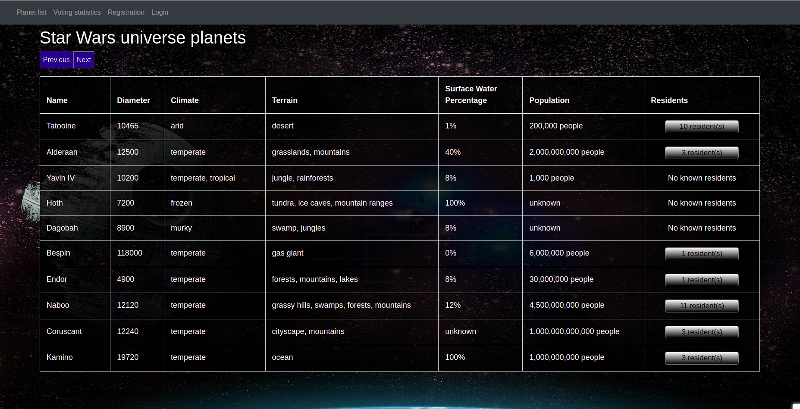
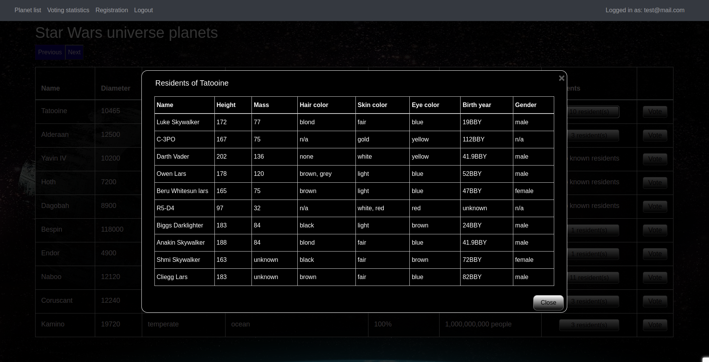
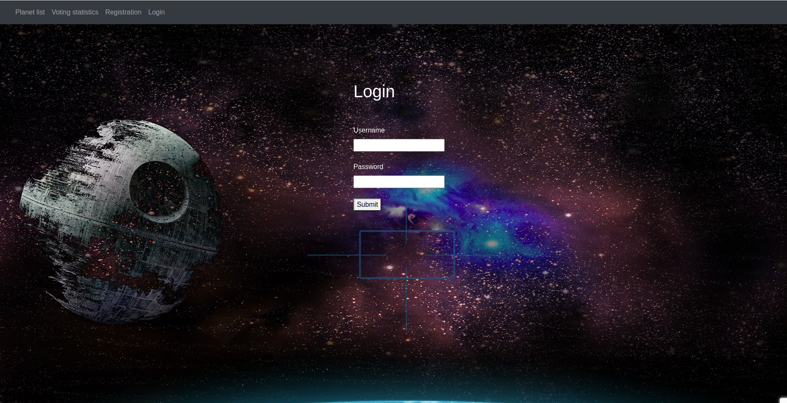
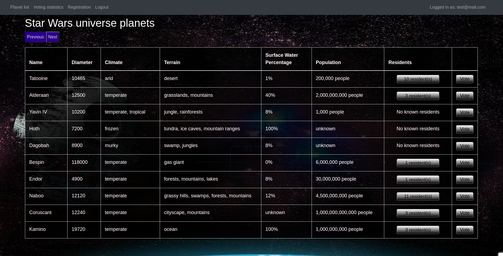
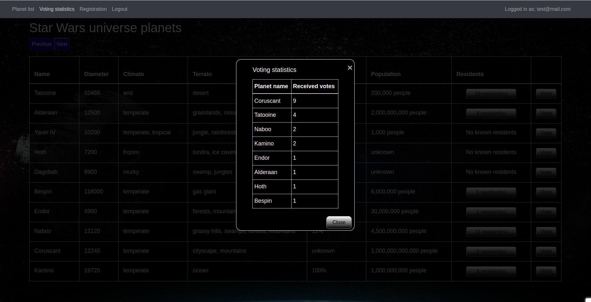

# Api-Wars

Simple web application that shows data about the Star Wars universe, stores visitor preferences with cookies, and handles user login with sessions.



## Technical Details

- Python project with Flask and Javascript.
- Routes with Flask.
- Simple queries in SQL.
- All data provided by The Star Wars API (https://swapi.dev)
- AJAX used for API requests.
- Session handling.
- Storing passwords.

## Features

- StarWars planet database
- Residents data for every planet
- Login system with registration
- Voting on planets
- Display voting statistics
- Stores users and votes in SQL database
- Salted password hashing

## Build/Run

### Requirements

- Python3
- Pip3
- PostgreSQL

```javascript

/* Install the needed packages */
pip install -r requirements.txt

/* Run the sample.sql script for creating the tables */

/* Configure your PostgreSQL Credentials in database_common.py:
user_name / password / host / database_name*/

/* Start the app */
python3 server.py

```

## Description of features

### Planet data on Index page

- Shows a table with all the planets in the Star Wars universe.
- The opening page of the website (/) shows the data of 10 planets.
- The data is represented in a table which is fully responsive (arranged into a list on smaller viewports).
- There is a next button above the table, clicking it shows the next 10 planets, if any.
- There is a previous button above the table, clicking it shows the previous 10 planets, if any.
- Unknown values for surface water percentage and population are stated clearly.

### Residents modal



- A button is displayed in each row if the planet has residents. These buttons open a modal and populate its data, containing the list of residents with more detailed information.
- The button shows the number of residents if the planet has any, otherwise the No known residents text is shown.
- Clicking the residents button in the planet table, a modal is displayed, showing all the residents of the planet (every time).
- Data is loaded into the table without refreshing the page (with AJAX).
- There is an X icon in the top right corner and a Close button in the bottom right corner; clicking these closes the modal.

### Login system



- Simple user login system with a registration page, a login page, and a logout link in the header.
- There is a link in the header that leads to the registration page.
- On the registration page (/register route), a username and password pair can be created that gets stored in the database.
- Password storage and retrieval uses salted password hashing for maximum security.
- If either field is empty while clicking the Submit button on the registration page, the Please, fill in both fields. error message is displayed.
- If the username field contains a username that already exists in the database while clicking the Submit button on the registration page, the „Username already exists, please choose another one!” error message is displayed.
- On successful registration, the ”Successful registration. Log in to continue.” text is displayed, and the user is redirected to the login page.
- There is a link also in the header that leads to the login page.
- On the login page (/login route), visitors can log in using the previously created username and password.
- If the username and password pair does not match while clicking the Submit button on the login page, the ”Wrong username or password.” error message is displayed.
- After logging in, the username is displayed in the top right corner with the text ”Signed in as” and a logout link is displayed in the header.
- Clicking the logout link (/logout route) logs the user out.

### Voting on planets



- If the user is logged in, a button is displayed in each row with which the logged in user can vote on a planet.
- Clicking the vote button saves the vote in the database without refreshing the page (with AJAX).
- Users can vote on an unlimited number of planets and with an unlimited number of votes on a planet.

### Voting statistics



- There is a link in the header that opens a modal showing voting statistics based on the user votes saved in the database.
- The modal is represented in a table which is fully responsive (arranged into a list on smaller viewports).
- Data is loaded into the table without refreshing the page (with AJAX).
- There is an X icon in the top right corner and a Close button in the bottom right corner; clicking these closes the modal.
